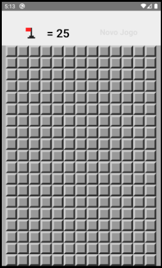

# Projeto de Campo minado utilizando React-Native :bomb:

## Aplicativo desenvolvido junto ao curso de [React-Native](https://www.udemy.com/course/curso-react-native/) com o professor [Leonado Leitão](https://github.com/leonardomleitao)

### Imagem da tela principal do Aplicativo

#### [Cod3r Cursos - GitHub](https://github.com/cod3rcursos)
#### [Cod3r Cursos - Udemy](https://www.udemy.com/user/cod3r-3/)
#### [Cod3r Cursos - Site](https://www.cod3r.com.br/)